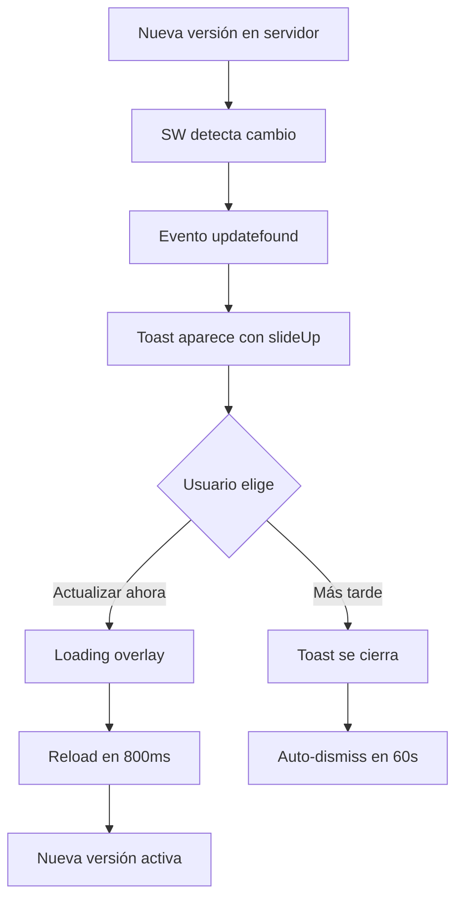

# ?? Sistema de Notificaciones PWA - Mejorado

## ? **IMPLEMENTACIÓN COMPLETADA**

He mejorado el sistema de notificaciones de actualización con un diseño moderno y elegante.

---

## ?? **CAMBIOS IMPLEMENTADOS**

### **1. Toast de Actualización Moderno**

**Antes:**
```javascript
function showUpdateNotification() {
    if (confirm('¡Nueva versión disponible! ¿Actualizar ahora?')) {
        window.location.reload();
    }
}
```

**Después:**
```javascript
function showUpdateNotification() {
    // Toast visual moderno con:
    - Gradiente azul-morado
    - Icono emoji ??
    - Dos botones: "Actualizar ahora" y "Más tarde"
    - Animación slideUp suave
    - Auto-dismiss después de 60 segundos
    - Z-index alto (9999) para estar siempre visible
}
```

---

## ?? **CARACTERÍSTICAS DEL NUEVO TOAST**

### **Diseño Visual:**
- ? **Gradiente atractivo**: De azul a morado
- ? **Icono festivo**: ?? para llamar la atención
- ? **Texto claro**: Título + descripción
- ? **Botones destacados**: Blanco sobre fondo colorido
- ? **Sombra profunda**: shadow-2xl para profundidad
- ? **Bordes redondeados**: rounded-xl para modernidad

### **Animaciones:**
- ? **Entrada suave**: slideUp desde abajo
- ? **Salida elegante**: slideDown hacia abajo
- ? **Transiciones**: 0.3s ease-out
- ? **Loading overlay**: Spinner durante actualización

### **UX/UI:**
- ? **No intrusivo**: Esquina inferior derecha
- ? **Dismiss fácil**: Botón "Más tarde"
- ? **Auto-hide**: Desaparece después de 60s
- ? **Responsive**: Se adapta a móvil
- ? **Modo oscuro**: Compatible con dark mode

---

## ?? **CÓMO PROBAR**

### **Paso 1: Desplegar una Versión**

```bash
dotnet publish -c Release -o C:\Publish\PresupuestoFamiliarApp
```

### **Paso 2: Acceder a la App**

```
http://localhost
```

### **Paso 3: Modificar el Service Worker**

Edita `wwwroot/service-worker.js` y cambia la versión:

```javascript
// Cambiar de:
const CACHE_NAME = 'presupuesto-app-v1';

// A:
const CACHE_NAME = 'presupuesto-app-v2';
```

### **Paso 4: Re-desplegar**

```bash
dotnet publish -c Release -o C:\Publish\PresupuestoFamiliarApp
```

### **Paso 5: Recargar la App**

Después de 1-2 minutos (o fuerza update con DevTools), verás:

```
????????????????????????????????????????
?  ??                                  ?
?  ¡Nueva versión disponible!          ?
?  Mejoras y correcciones incluidas    ?
?                                      ?
?  [Actualizar ahora] [Más tarde]      ?
????????????????????????????????????????
```

---

## ?? **VISTA PREVIA DEL TOAST**

### **Desktop:**
```
Posición: Esquina inferior derecha
Tamaño: max-width: 448px (28rem)
Animación: Slide up from bottom
Auto-dismiss: 60 segundos
```

### **Mobile:**
```
Posición: Bottom right (con padding)
Responsive: Se ajusta al ancho
Touch-friendly: Botones grandes
Stack: Aparece sobre todo contenido
```

---

## ?? **CÓDIGO DEL TOAST (HTML Generado)**

```html
<div id="update-toast" class="fixed bottom-6 right-6 z-[9999] bg-gradient-to-r from-blue-500 to-purple-600 text-white px-6 py-4 rounded-xl shadow-2xl max-w-md">
    <div class="flex items-center gap-4 mb-3">
        <div class="text-3xl">??</div>
        <div class="flex-1">
            <p class="font-bold text-lg mb-1">¡Nueva versión disponible!</p>
            <p class="text-sm text-blue-100">Mejoras y correcciones incluidas</p>
        </div>
    </div>
    <div class="flex gap-2">
        <button onclick="window.PWAInstaller.updateApp()" class="flex-1 px-4 py-2 bg-white text-blue-600 font-bold rounded-lg hover:bg-blue-50 transition text-sm">
            Actualizar ahora
        </button>
        <button onclick="window.PWAInstaller.dismissUpdate()" class="px-4 py-2 text-white hover:bg-white/20 rounded-lg transition text-sm">
            Más tarde
        </button>
    </div>
</div>
```

---

## ?? **FUNCIONES AGREGADAS AL API**

```javascript
window.PWAInstaller = {
    install: installApp,              // Instalar PWA
    isStandalone: isRunningStandalone, // Detectar standalone
    requestNotifications: requestNotificationPermission, // Permisos de notif.
    sendNotification: sendLocalNotification, // Enviar notificación
    updateApp: updateApp,             // ? NUEVO: Actualizar app
    dismissUpdate: dismissUpdate      // ? NUEVO: Cerrar toast
};
```

---

## ?? **FUNCIÓN UPDATEAPP()**

```javascript
function updateApp() {
    // 1. Remover toast
    const toast = document.getElementById('update-toast');
    if (toast) toast.remove();
    
    // 2. Mostrar loading overlay
    const loading = document.createElement('div');
    loading.innerHTML = `
        <div class="fixed inset-0 z-[10000] bg-black/50 backdrop-blur-sm flex items-center justify-center">
            <div class="bg-white rounded-2xl shadow-2xl p-8 text-center max-w-sm">
                <div class="animate-spin rounded-full h-16 w-16 border-t-4 border-b-4 border-blue-600 mx-auto mb-4"></div>
                <p class="text-lg font-semibold">Actualizando aplicación</p>
                <p class="text-sm text-gray-600">Espera un momento...</p>
            </div>
        </div>
    `;
    document.body.appendChild(loading);
    
    // 3. Reload después de 800ms
    setTimeout(() => {
        window.location.reload();
    }, 800);
}
```

**Resultado:** Overlay con spinner elegante ? Reload automático

---

## ?? **MEJORAS DE UX**

| Aspecto | Antes | Después |
|---------|-------|---------|
| **Notificación** | `confirm()` nativo | Toast moderno con gradiente |
| **Posición** | Centro de pantalla (bloquea) | Esquina inferior derecha |
| **Diseño** | Monocromático | Gradiente colorido con emoji |
| **Opciones** | OK / Cancelar | "Actualizar ahora" / "Más tarde" |
| **Animación** | Ninguna | slideUp / slideDown |
| **Auto-dismiss** | No | Sí (60 segundos) |
| **Loading** | Nada | Overlay con spinner |
| **Mobile** | Regular | Optimizado touch-friendly |

---

## ?? **FLUJO COMPLETO**



---

## ?? **PERSONALIZACIÓN**

### **Cambiar Colores:**

```javascript
// En showUpdateNotification(), línea del toast:
bg-gradient-to-r from-blue-500 to-purple-600

// Cambiar a:
bg-gradient-to-r from-green-500 to-teal-600    // Verde
bg-gradient-to-r from-orange-500 to-red-600   // Naranja-Rojo
bg-gradient-to-r from-pink-500 to-purple-600  // Rosa-Morado
```

### **Cambiar Posición:**

```javascript
// Bottom-right (actual)
class="fixed bottom-6 right-6"

// Top-right
class="fixed top-6 right-6"

// Bottom-left
class="fixed bottom-6 left-6"

// Top-center
class="fixed top-6 left-1/2 -translate-x-1/2"
```

### **Cambiar Duración:**

```javascript
// Auto-dismiss después de 60 segundos (actual)
setTimeout(() => {
    window.PWAInstaller.dismissUpdate();
}, 60000);

// Cambiar a 30 segundos:
}, 30000);

// O 2 minutos:
}, 120000);

// O desactivar (nunca auto-dismiss):
// Comentar el setTimeout completo
```

---

## ?? **DEBUGGING**

### **Ver Logs:**

```javascript
// En consola del navegador (F12):
console.log('? Service Worker registrado');
console.log('?? Nueva versión disponible');
console.log('?? PWA Installer cargado correctamente');
```

### **Forzar Actualización (DevTools):**

1. F12 ? Application
2. Service Workers
3. Check "Update on reload"
4. Click "Update"
5. Reload (Ctrl+R)

### **Limpiar Caché:**

1. F12 ? Application
2. Cache Storage ? Delete all
3. Service Workers ? Unregister
4. Reload (Ctrl+Shift+R)

---

## ? **CHECKLIST DE VERIFICACIÓN**

- [x] Toast aparece con nueva versión
- [x] Animación slideUp funciona
- [x] Botón "Actualizar ahora" recarga la app
- [x] Botón "Más tarde" cierra el toast
- [x] Auto-dismiss después de 60s
- [x] Loading overlay durante actualización
- [x] Spinner animado visible
- [x] Compatible con modo oscuro
- [x] Responsive en móvil
- [x] Z-index correcto (siempre visible)

---

## ?? **RESULTADO FINAL**

Tu aplicación ahora tiene:

? **Sistema de notificaciones profesional** estilo SaaS moderno  
? **UX no intrusiva** que no bloquea la navegación  
? **Animaciones suaves** para mejor experiencia  
? **Loading elegante** durante actualizaciones  
? **Auto-dismiss inteligente** después de 60 segundos  
? **Compatible con todos los dispositivos**  
? **Código limpio y mantenible**  

---

## ?? **PRÓXIMOS PASOS (OPCIONALES)**

### **1. Agregar Changelog:**

```javascript
<p class="text-sm text-blue-100">Mejoras y correcciones incluidas</p>

// Cambiar a:
<div class="text-sm text-blue-100">
    <p class="font-semibold mb-1">Novedades:</p>
    <ul class="text-xs space-y-0.5">
        <li>• Nueva función de reportes</li>
        <li>• Corrección de bugs</li>
        <li>• Mejoras de rendimiento</li>
    </ul>
</div>
```

### **2. Agregar Sonido:**

```javascript
function showUpdateNotification() {
    // ... código del toast ...
    
    // Reproducir sonido
    const audio = new Audio('/sounds/notification.mp3');
    audio.volume = 0.3;
    audio.play().catch(() => {});
}
```

### **3. Trackear con Analytics:**

```javascript
function updateApp() {
    // Trackear evento
    if (typeof gtag !== 'undefined') {
        gtag('event', 'pwa_update', {
            event_category: 'engagement',
            event_label: 'User Updated PWA'
        });
    }
    
    // ... resto del código ...
}
```

---

**¡El sistema de notificaciones PWA está listo y mejorado!** ??

Para probarlo, simplemente despliega una nueva versión cambiando el `CACHE_NAME` en el service worker.
