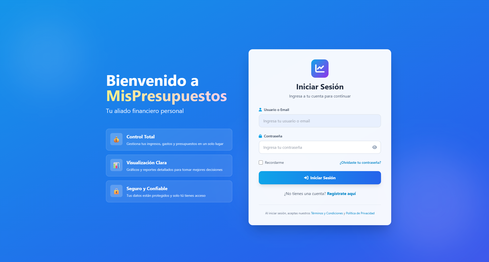
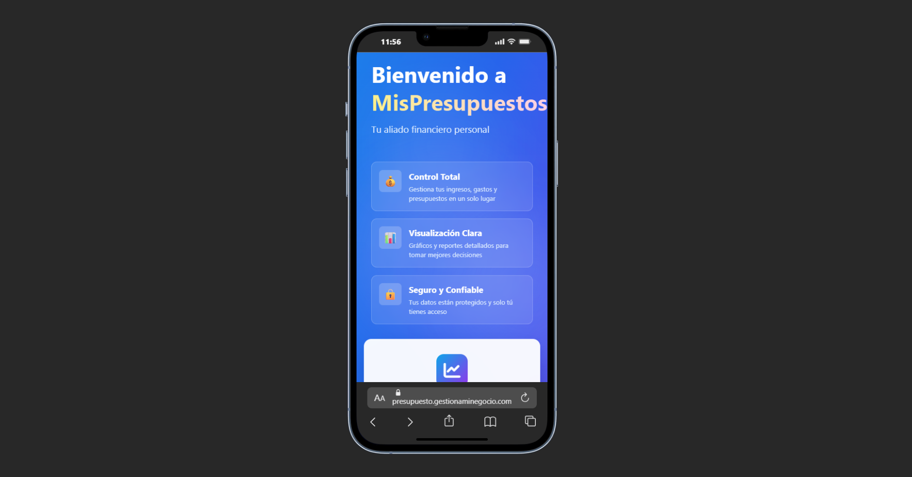

# 💰 MisPresupuestos App

**MisPresupuestos** es una aplicación web para gestionar finanzas personales y familiares de manera sencilla y eficiente. Construida con ASP.NET Core 9, permite llevar un control detallado de ingresos, gastos, presupuestos, suscripciones y cuentas por cobrar, todo en un mismo lugar.

---

## ✨ Características Principales

| Módulo | Descripción |
|--------|-------------|
| 📊 **Dashboard** | Resumen mensual de ingresos, egresos y ahorro proyectado con gráficos interactivos |
| 🏦 **Cuentas** | Gestiona cuentas bancarias, efectivo y tarjetas de crédito en distintas monedas |
| 💸 **Transacciones** | Registra y categoriza ingresos y egresos con soporte multi-moneda y tipo de cambio |
| 🔄 **Transferencias** | Mueve dinero entre tus cuentas fácilmente |
| 📋 **Presupuestos** | Define presupuestos mensuales por categoría y controla el cumplimiento |
| 🔁 **Movimientos Fijos** | Automatiza el registro de ingresos y gastos recurrentes |
| 📡 **Suscripciones** | Lleva el control de servicios con pago periódico |
| 👥 **Deudores** | Gestiona cuentas por cobrar y realiza seguimiento de deudas |
| 💱 **Tipos de Cambio** | Soporte para múltiples monedas (Soles, Dólares, Euros, etc.) |
| 🏠 **Espacios** | Separa tus finanzas en espacios independientes (Hogar, Negocio, Proyecto, etc.) |
| 🔔 **Notificaciones Push** | Alertas de vencimientos y movimientos importantes (PWA) |
| 📱 **PWA** | Instalable como app nativa en cualquier dispositivo |

---

## 📸 Capturas de Pantalla

### Pantalla Principal (Dashboard)


### Vista Móvil


---

## 🛠️ Tecnologías Utilizadas

- **Backend:** ASP.NET Core 9 (MVC)
- **Base de datos:** SQL Server + Entity Framework Core 9
- **Autenticación:** Cookie Authentication con roles (Usuario / Administrador)
- **Jobs programados:** Hangfire (movimientos fijos recurrentes)
- **Gráficos:** ScottPlot
- **Reportes:** ClosedXML (exportación a Excel)
- **Notificaciones Push:** Web Push / VAPID
- **Frontend:** Tailwind CSS, Font Awesome, Chart.js
- **PWA:** Service Worker + Web App Manifest

---

## 🚀 Requisitos Previos

| Herramienta | Versión mínima |
|-------------|----------------|
| [.NET SDK](https://dotnet.microsoft.com/download) | 9.0 |
| [SQL Server](https://www.microsoft.com/sql-server) | 2019 / Express |
| [Visual Studio](https://visualstudio.microsoft.com/) o VS Code | 2022 / latest |

---

## ⚙️ Instalación y Configuración Local

### 1. Clonar el repositorio

```bash
git clone https://github.com/rockespier/presupuestoApp.git
cd presupuestoApp
```

### 2. Configurar la cadena de conexión

Edita el archivo `src/appsettings.json` y actualiza la conexión a tu instancia de SQL Server:

```json
{
  "ConnectionStrings": {
    "DefaultConnection": "Server=localhost;Database=PresupuestoDB;Trusted_Connection=True;TrustServerCertificate=True;"
  }
}
```

### 3. Aplicar las migraciones de base de datos

```bash
cd src
dotnet ef database update
```

### 4. Ejecutar la aplicación

```bash
dotnet run
```

La aplicación estará disponible en: `https://localhost:5001`

---

## 📁 Estructura del Proyecto

```
presupuestoApp/
├── src/
│   ├── Controllers/          # Controladores MVC
│   │   ├── HomeController.cs
│   │   ├── TransaccionesController.cs
│   │   ├── CuentasController.cs
│   │   ├── CategoriasController.cs
│   │   ├── PresupuestosController.cs (via Categorías)
│   │   ├── MovimientosFijosController.cs
│   │   ├── EspaciosController.cs
│   │   ├── CuentasPorCobrarController.cs
│   │   ├── TiposCambioController.cs
│   │   ├── TransferenciasController.cs
│   │   └── AuthController.cs
│   ├── Models/               # Modelos de dominio
│   ├── Data/                 # DbContext y configuración EF Core
│   ├── Servicios/            # Servicios (Email, Push, Automatización)
│   ├── Views/                # Vistas Razor
│   ├── ViewModels/           # ViewModels
│   ├── Migrations/           # Migraciones de EF Core
│   └── wwwroot/              # Archivos estáticos (CSS, JS, imágenes)
├── tests/                    # Proyecto de pruebas
└── PresupuestoFamiliarApp.sln
```

---

## 🏠 Espacios de Trabajo

Los **Espacios** permiten separar completamente diferentes áreas de tus finanzas. Cada espacio es independiente y tiene su propia configuración, cuentas y categorías:

- 🏡 **Finanzas Personales** – Para gastos del día a día
- 💼 **Mi Negocio** – Para las finanzas de tu empresa
- 🏠 **Hogar Familiar** – Para gastos compartidos en familia
- 🎯 **Proyecto Específico** – Para un viaje, evento o meta puntual

---

## 💱 Soporte Multi-Moneda

La app soporta las siguientes monedas:

- 🇵🇪 Soles (PEN)
- 🇺🇸 Dólares (USD)
- 🇪🇺 Euros (EUR)
- Y más monedas configurables desde el módulo **Tipos de Cambio**

Cada transacción puede registrarse en su moneda original, aplicando automáticamente la tasa de cambio configurada.

---

## 📱 Progressive Web App (PWA)

La aplicación puede instalarse en cualquier dispositivo como si fuera una app nativa:

**En escritorio (Chrome/Edge):**
1. Abre la app en el navegador
2. Haz clic en el ícono de instalación en la barra de direcciones
3. Confirma la instalación

**En Android:**
1. Abre la app en Chrome
2. Acepta el banner "Agregar a la pantalla de inicio"

**En iOS (Safari):**
1. Toca el botón de compartir
2. Selecciona "Agregar a la pantalla de inicio"

Para más detalles, consulta la [Guía PWA](src/PWA-README.md).

---

## 🚢 Despliegue en Producción (IIS)

Para desplegar en un servidor Windows con IIS, consulta la [Guía de Despliegue](src/README-DEPLOY.md).

**Requisitos del servidor:**

| Requisito | Descripción |
|-----------|-------------|
| Windows | Server 2016/2019/2022 o Windows 10/11 |
| IIS | Internet Information Services instalado |
| .NET 9 | Hosting Bundle instalado |
| SQL Server | Express, Standard o Enterprise |
| RAM | Mínimo 2 GB (Recomendado 4 GB) |

---

## 🔐 Roles y Permisos

| Rol | Acceso |
|-----|--------|
| **Usuario** | Gestión completa de sus propias finanzas |
| **Administrador** | Panel de pruebas adicional y acceso a Hangfire Dashboard (`/hangfire`) |

---

## 🧪 Pruebas

```bash
cd tests
dotnet test
```

---

## 🤝 Contribuir

1. Haz un fork del repositorio
2. Crea una rama para tu feature: `git checkout -b feature/nueva-funcionalidad`
3. Realiza tus cambios y haz commit: `git commit -m 'feat: añadir nueva funcionalidad'`
4. Sube tus cambios: `git push origin feature/nueva-funcionalidad`
5. Abre un Pull Request

---

## 📄 Licencia

Este proyecto es de uso privado. Todos los derechos reservados.

---

## 👨‍💻 Autor

Desarrollado con ❤️ para el control de finanzas personales y familiares.
