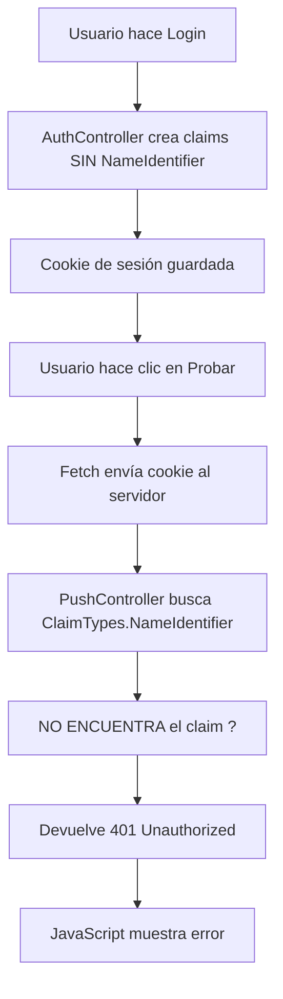
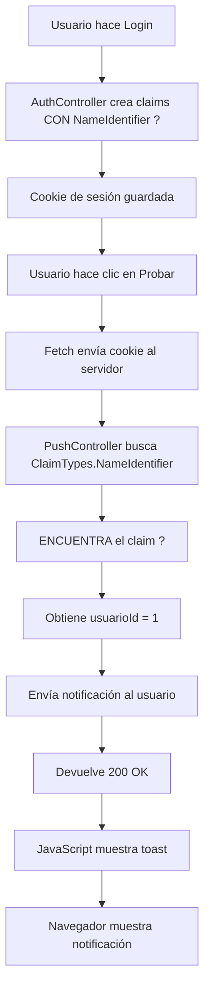

# ? Solución Final: "Usuario no autenticado" en Notificaciones Push

## ? **Problema**

Al hacer clic en el botón "Probar", aparecía el siguiente error:

```
? Error al enviar notificación de prueba: Error: Usuario no autenticado
```

A pesar de que:
- ? El JavaScript incluía `credentials: 'include'`
- ? El usuario estaba logueado (aparecía su nombre en el menú)
- ? Las cookies de sesión existían

---

## ?? **Causa Raíz del Problema**

El problema estaba en el **AuthController**, específicamente en el método `Login()`. Cuando el usuario iniciaba sesión, se estaban creando estos claims:

```csharp
// ? ANTES (Sin NameIdentifier)
var claims = new List<Claim>
{
    new Claim(ClaimTypes.Name, usuario.NombreUsuario),
    new Claim(ClaimTypes.Email, usuario.Email),
    new Claim(ClaimTypes.Role, usuario.Rol),
    new Claim("EspaciosPermitidos", espaciosPermitidos)
    // ?? FALTABA: ClaimTypes.NameIdentifier
};
```

Pero el **PushController** intentaba obtener el ID del usuario así:

```csharp
var usuarioIdClaim = User.FindFirst(ClaimTypes.NameIdentifier)?.Value;
if (string.IsNullOrEmpty(usuarioIdClaim) || !int.TryParse(usuarioIdClaim, out int usuarioId))
{
    return Unauthorized(new { message = "Usuario no autenticado" });
}
```

Como el `ClaimTypes.NameIdentifier` **no existía** en los claims, el servidor devolvía **401 Unauthorized** con el mensaje "Usuario no autenticado".

---

## ? **Solución Aplicada**

### **Agregado el Claim `ClaimTypes.NameIdentifier`**

Se modificó el método `Login()` en `AuthController.cs` para incluir el ID del usuario:

```csharp
// ? DESPUÉS (Con NameIdentifier)
var claims = new List<Claim>
{
    new Claim(ClaimTypes.NameIdentifier, usuario.Id.ToString()), // ? AGREGADO
    new Claim(ClaimTypes.Name, usuario.NombreUsuario),
    new Claim(ClaimTypes.Email, usuario.Email),
    new Claim(ClaimTypes.Role, usuario.Rol),
    new Claim("EspaciosPermitidos", espaciosPermitidos)
};
```

---

## ?? **¿Qué es ClaimTypes.NameIdentifier?**

`ClaimTypes.NameIdentifier` es un claim estándar de ASP.NET Core que representa el **identificador único del usuario** (generalmente el ID de la base de datos).

### **Claims Estándar en ASP.NET Core:**

| Claim | Descripción | Ejemplo |
|-------|-------------|---------|
| `ClaimTypes.NameIdentifier` | **ID único del usuario** | `"123"` |
| `ClaimTypes.Name` | Nombre de usuario para mostrar | `"admin"` |
| `ClaimTypes.Email` | Correo electrónico | `"admin@example.com"` |
| `ClaimTypes.Role` | Rol del usuario | `"Administrador"` |
| Custom Claim | Cualquier dato adicional | `"EspaciosPermitidos"` |

### **¿Por qué es importante?**

- ? Es el claim **estándar** para identificar usuarios
- ? Muchos métodos de ASP.NET Core lo buscan automáticamente
- ? Es el que usa `User.FindFirst(ClaimTypes.NameIdentifier)`
- ? Es el que usa `User.FindFirstValue(ClaimTypes.NameIdentifier)`

---

## ?? **Pasos para Aplicar la Solución**

### **1. Cerrar Sesión**

Como los claims se agregan **al momento del login**, necesitas cerrar sesión primero:

1. Haz clic en tu nombre en el menú superior
2. Selecciona **"Cerrar Sesión"**

### **2. Volver a Iniciar Sesión**

1. Ve a `/Auth/Login`
2. Ingresa tus credenciales
3. Haz clic en "Iniciar Sesión"

Ahora el nuevo claim `ClaimTypes.NameIdentifier` se agregará a tu cookie de sesión.

### **3. Verificar que el Claim fue Agregado**

Puedes verificar los claims en DevTools:

1. F12 ? **Application** ? **Cookies**
2. Haz clic en la cookie `.AspNetCore.Cookies`
3. Copia el valor
4. Ve a https://jwt.io (aunque no es JWT, sirve para ver claims)

O ejecuta esto en tu código:

```csharp
// En cualquier controlador:
var claims = User.Claims.ToList();
foreach (var claim in claims)
{
    Console.WriteLine($"{claim.Type}: {claim.Value}");
}
```

Deberías ver:
```
http://schemas.xmlsoap.org/ws/2005/05/identity/claims/nameidentifier: 1
http://schemas.xmlsoap.org/ws/2005/05/identity/claims/name: admin
http://schemas.xmlsoap.org/ws/2005/05/identity/claims/emailaddress: admin@example.com
http://schemas.microsoft.com/ws/2008/06/identity/claims/role: Administrador
EspaciosPermitidos: 1,2,3
```

---

## ?? **Probar las Notificaciones**

Una vez que hayas cerrado sesión y vuelto a iniciar:

### **1. Ve a Configuración**
```
https://localhost:7036/Configuracion
```

### **2. Activa las Notificaciones**

Si aún no las has activado:
1. Haz clic en **"Activar Notificaciones"**
2. Permite los permisos en el navegador

### **3. Haz Clic en "Probar"**

Ahora deberías ver:

**En la consola:**
```javascript
? Notificación de prueba enviada
```

**En la pantalla (toast):**
```
Notificación de prueba enviada!
```

**Notificación del navegador:**
```
?? Notificación de Prueba
Las notificaciones push están funcionando correctamente!
```

---

## ?? **Flujo Completo Corregido**

### **Antes (? Fallaba):**



### **Después (? Funciona):**



---

## ?? **Resumen de Cambios**

### **Archivo Modificado:**
- `Controllers\AuthController.cs`

### **Cambio Realizado:**
```csharp
// Línea agregada en el método Login():
new Claim(ClaimTypes.NameIdentifier, usuario.Id.ToString()),
```

### **Impacto:**
- ? El ID del usuario ahora se incluye en la cookie de sesión
- ? Las APIs pueden identificar al usuario correctamente
- ? Las notificaciones push funcionan
- ? Cualquier otro endpoint que necesite el ID del usuario funcionará

---

## ?? **Verificación en Base de Datos**

Después de activar las notificaciones y hacer clic en "Probar", verifica:

```sql
-- Ver las suscripciones
SELECT 
    Id,
    UsuarioId,
    LEFT(Endpoint, 50) as EndpointPreview,
    Activa,
    FechaCreacion
FROM PushSubscriptions
WHERE UsuarioId = 1  -- Reemplaza con tu ID
ORDER BY FechaCreacion DESC
```

Deberías ver tu suscripción con `Activa = 1`.

---

## ?? **Importante: Reiniciar Sesión**

**Los cambios en los claims solo se aplican en nuevos inicios de sesión.**

Si ya estabas logueado cuando hiciste el cambio:
1. ? Los claims antiguos siguen en la cookie
2. ? Necesitas cerrar sesión y volver a iniciar

**NO es suficiente con:**
- ? Recargar la página
- ? Limpiar la caché
- ? Reiniciar el navegador

**Debes:**
- ? Cerrar sesión explícitamente
- ? Volver a iniciar sesión

---

## ?? **Resultado Final**

Después de cerrar sesión y volver a iniciar, todo el sistema de notificaciones funciona:

### **1. Activar Notificaciones ?**
- Haz clic en "Activar Notificaciones"
- Permite los permisos
- Se guarda en la base de datos

### **2. Probar Notificación ?**
- Haz clic en "Probar"
- Se envía la notificación
- Aparece en el navegador

### **3. Notificaciones Automáticas desde Hangfire ?**
- Ve a `https://localhost:7036/hangfire/recurring`
- Haz clic en "Trigger now" en `NotificarVencimientos`
- Se envían notificaciones de vencimientos próximos

---

## ?? **Troubleshooting Adicional**

### **Si aún dice "Usuario no autenticado":**

1. **Verifica que cerraste sesión:**
   ```
   No estás en el menú ? ? Correcto
   Aún aparece tu nombre ? ? Cierra sesión
   ```

2. **Verifica los claims en el código:**
   ```csharp
   // En cualquier controller:
   public IActionResult VerClaims()
   {
       var claims = User.Claims.Select(c => new { c.Type, c.Value }).ToList();
       return Json(claims);
   }
   ```

3. **Limpia las cookies manualmente:**
   ```
   F12 ? Application ? Cookies ? Eliminar todas
   ```

### **Si el botón "Activar Notificaciones" da error:**

El problema puede ser diferente. Revisa:
- ¿Existe la tabla `PushSubscriptions`?
- ¿El servidor está corriendo?
- ¿Hay algún error en la consola del servidor?

---

## ?? **Buenas Prácticas**

### **Siempre incluir ClaimTypes.NameIdentifier**

Al crear claims de autenticación, siempre incluye:

```csharp
var claims = new List<Claim>
{
    new Claim(ClaimTypes.NameIdentifier, user.Id.ToString()),  // ? REQUERIDO
    new Claim(ClaimTypes.Name, user.UserName),
    new Claim(ClaimTypes.Email, user.Email),
    new Claim(ClaimTypes.Role, user.Role),
    // ... otros claims personalizados
};
```

### **Obtener el ID del usuario en Controllers**

Hay dos formas de obtener el ID del usuario:

```csharp
// Opción 1: FindFirst (con null checking)
var userIdClaim = User.FindFirst(ClaimTypes.NameIdentifier)?.Value;
if (!string.IsNullOrEmpty(userIdClaim) && int.TryParse(userIdClaim, out int userId))
{
    // Usar userId
}

// Opción 2: FindFirstValue (más simple)
var userIdString = User.FindFirstValue(ClaimTypes.NameIdentifier);
if (int.TryParse(userIdString, out int userId))
{
    // Usar userId
}
```

---

## ? **Checklist Final**

Antes de dar por resuelto el problema:

- [x] Agregado `ClaimTypes.NameIdentifier` en AuthController
- [ ] Compilado el proyecto (`dotnet build`)
- [ ] Cerrado sesión en la aplicación
- [ ] Vuelto a iniciar sesión
- [ ] Verificado que el botón "Activar Notificaciones" funciona
- [ ] Verificado que el botón "Probar" funciona
- [ ] Recibido la notificación de prueba en el navegador

---

**¡Sistema de notificaciones push completamente funcional!** ??

Ahora puedes:
- ? Activar/desactivar notificaciones
- ? Enviar notificaciones de prueba
- ? Recibir notificaciones automáticas desde Hangfire
- ? Notificar sobre vencimientos de cuentas por cobrar
- ? Notificar sobre presupuestos excedidos
