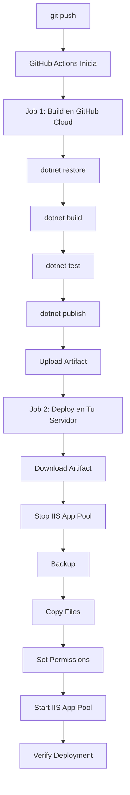

# ?? SOLUCIÓN DEFINITIVA: Build en GitHub + Deploy en Servidor

## ? **EL PROBLEMA REAL**

El servidor **NO tiene SDK de .NET**, solo tiene **RUNTIMES**:

```
Runtimes installed:
  Microsoft.AspNetCore.App 7.0.20
  Microsoft.AspNetCore.App 9.0.13
  Microsoft.AspNetCore.App 10.0.1
  Microsoft.NETCore.App 7.0.20
  Microsoft.NETCore.App 9.0.13
  Microsoft.NETCore.App 10.0.1

No .NET SDKs were found.
```

**Comandos que requieren SDK:**
- ? `dotnet restore` ? Requiere SDK
- ? `dotnet build` ? Requiere SDK
- ? `dotnet publish` ? Requiere SDK

**Comandos que solo requieren Runtime:**
- ? `dotnet run` (con archivos ya compilados)
- ? Ejecutar aplicaciones publicadas

---

## ?? **LA SOLUCIÓN: Arquitectura de 2 Jobs**

### **Job 1: Build (GitHub-Hosted Runner)**
- Compila en la nube de GitHub
- Tiene SDK completo de .NET
- Genera archivos publicados
- Sube los archivos como "artifact"

### **Job 2: Deploy (Self-Hosted Runner)**
- Descarga el artifact
- Solo copia archivos al servidor
- NO necesita SDK
- Solo requiere PowerShell y acceso a IIS

---

## ?? **Flujo Completo**



---

## ?? **Ventajas de Esta Solución**

| Ventaja | Descripción |
|---------|-------------|
| **? Cero Configuración en Servidor** | No necesitas instalar SDK |
| **? Compilación Rápida** | GitHub runners son muy potentes |
| **? Build Consistente** | Siempre el mismo entorno de compilación |
| **? Menos Carga en Tu Servidor** | Solo copia archivos |
| **? Funciona Inmediatamente** | Sin necesidad de modificar el servidor |
| **? Gratis** | GitHub Actions da 2000 min/mes gratis |

---

## ?? **Cómo Funciona el Nuevo Workflow**

### **Paso 1: Compilación en GitHub Cloud**

```yaml
jobs:
  build:
    name: Build on GitHub Hosted Runner
    runs-on: windows-latest  # ? Runner de GitHub (tiene SDK)
    
    steps:
      - Checkout code
      - Setup .NET 9.0
      - Restore dependencies
      - Build
      - Run tests
      - Publish
      - Upload artifact  # ? Sube los archivos compilados
```

### **Paso 2: Deployment en Tu Servidor**

```yaml
  deploy:
    name: Deploy to IIS
    needs: build  # ? Espera a que build termine
    runs-on: self-hosted  # ? Tu servidor
    
    steps:
      - Download artifact  # ? Descarga los archivos compilados
      - Stop IIS App Pool
      - Backup Previous Deployment
      - Deploy to IIS  # ? Solo copia archivos
      - Set Permissions
      - Start IIS App Pool
      - Verify Deployment
```

---

## ?? **Comparación: Antes vs Después**

| Aspecto | ? Antes | ? Después |
|---------|----------|-----------|
| **Dónde compila** | Servidor (sin SDK) | GitHub Cloud (con SDK) |
| **Requiere SDK en servidor** | Sí | No |
| **Tiempo de compilación** | Lento | Rápido |
| **Uso de recursos del servidor** | Alto | Bajo |
| **Dependencias** | SDK, NuGet, etc. | Solo runtime |
| **Configuración necesaria** | Mucha | Ninguna |

---

## ?? **Detalles Técnicos**

### **Artifacts en GitHub Actions**

Los "artifacts" son archivos que se comparten entre jobs:

```yaml
# Job 1: Sube archivos
- name: Upload artifact
  uses: actions/upload-artifact@v4
  with:
    name: published-app
    path: ./publish
    retention-days: 1  # Se borran después de 1 día

# Job 2: Descarga archivos
- name: Download artifact
  uses: actions/download-artifact@v4
  with:
    name: published-app
    path: ./publish
```

### **Dependencia Entre Jobs**

```yaml
deploy:
  needs: build  # ? Solo inicia si 'build' es exitoso
```

---

## ?? **Output Esperado**

### **Job 1: Build**

```
? Checkout code
? Setup .NET
  .NET version: 9.0.x installed
? Restore dependencies
  Restored 45 packages
? Build
  Build succeeded. 0 Warning(s), 0 Error(s)
? Run tests
  No test projects found - skipping tests
? Publish
  Published to ./publish
? Upload artifact
  Artifact 'published-app' uploaded (25 MB)
```

### **Job 2: Deploy**

```
? Download artifact
  Artifact 'published-app' downloaded
? Stop IIS App Pool
  App Pool stopped successfully
? Backup Previous Deployment
  Backup created at C:\Backups\PresupuestoApp_20260321_161749
? Deploy to IIS
  Files deployed successfully
  [OK] PresupuestoFamiliarApp.dll
  [OK] web.config
  [OK] appsettings.json
? Set Permissions
  Permissions set successfully
? Start IIS App Pool
  App Pool started successfully
? Verify Deployment
  Application is responding (HTTP 200 OK)
  DEPLOYMENT COMPLETED SUCCESSFULLY!
```

---

## ?? **Troubleshooting**

### **Error: "Could not download artifact"**

**Causa:** El job de build falló

**Solución:**
1. Ve a la pestaña "Actions" en GitHub
2. Click en el workflow que falló
3. Revisa el job "Build" para ver qué falló
4. Corrige el error y vuelve a hacer push

### **Error: "App Pool failed to start"**

**Causa:** Posibles problemas con la aplicación

**Solución:**
```powershell
# En el servidor, revisa los logs:
Get-Content "C:\inetpub\wwwroot\presupuesto.gestionaminegocio.com\logs\stdout.log" -Tail 50
```

### **Workflow Tarda Mucho**

**Normal:** El job de build en GitHub puede tardar 2-3 minutos

**Si tarda más de 5 minutos:**
- Revisa si hay muchos paquetes NuGet
- Verifica la conexión a internet
- Considera usar caché de NuGet (opcional)

---

## ?? **Optimizaciones Futuras (Opcionales)**

### **1. Caché de NuGet**

Para acelerar builds futuros:

```yaml
- name: Cache NuGet packages
  uses: actions/cache@v4
  with:
    path: ~/.nuget/packages
    key: ${{ runner.os }}-nuget-${{ hashFiles('**/*.csproj') }}
```

### **2. Conditional Deployment**

Desplegar solo si hay cambios en ciertos archivos:

```yaml
on:
  push:
    branches: [ main ]
    paths:
      - '**.cs'
      - '**.cshtml'
      - '**.csproj'
```

### **3. Multiple Environments**

Desplegar a diferentes servidores:

```yaml
deploy-dev:
  if: github.ref == 'refs/heads/develop'
  # ...

deploy-prod:
  if: github.ref == 'refs/heads/main'
  # ...
```

---

## ? **Checklist Final**

Antes de hacer push, verifica:

- [ ] ? El workflow tiene 2 jobs: `build` y `deploy`
- [ ] ? `build` usa `runs-on: windows-latest`
- [ ] ? `deploy` usa `runs-on: self-hosted`
- [ ] ? `deploy` tiene `needs: build`
- [ ] ? Service Worker actualizado a v8

---

## ?? **Haz Push Ahora**

```powershell
# En tu PC:
git add .
git commit -m "fix: Split workflow into build and deploy jobs (SW v8)"
git push origin main
```

**Resultado esperado:**
1. Job "Build" se ejecuta en GitHub Cloud ? Compila exitosamente
2. Job "Deploy" se ejecuta en tu servidor ? Copia archivos
3. Aplicación desplegada ? ? Funciona!

---

## ?? **Diferencia Clave**

### **Antes:**
```
[Tu Servidor sin SDK]
  ? dotnet restore ? Error: No SDK found
```

### **Después:**
```
[GitHub Cloud con SDK]
  ? dotnet restore
  ? dotnet build  
  ? dotnet publish
  ?? Upload artifact

[Tu Servidor sin SDK]
  ?? Download artifact
  ? Copy files
  ? IIS restart
  ?? Done!
```

---

## ?? **Resumen Ejecutivo**

**Problema:** El servidor no tiene SDK, solo Runtimes
**Solución:** Compilar en GitHub, copiar archivos al servidor
**Ventaja:** No requiere configuración del servidor
**Resultado:** Deployment automático que funciona ?

---

**?? Esta solución DEFINITIVAMENTE debería funcionar. Haz push y verifica!**
