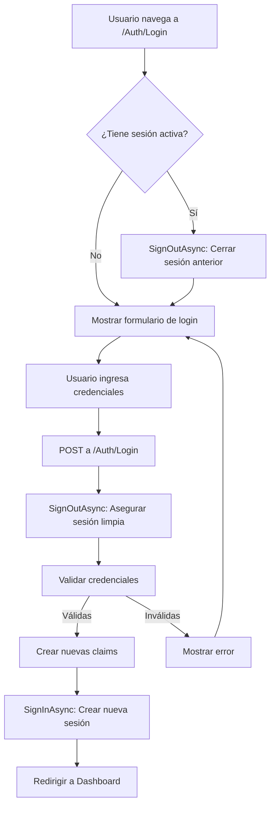

# ?? SOLUCIÓN: Sesión Persistente al Cambiar de Usuario

## ?? **PROBLEMA IDENTIFICADO**

Cuando un usuario iniciaba sesión después de que otro usuario ya había iniciado sesión (por ejemplo, el administrador), **la sesión anterior no se cerraba correctamente** y el nuevo usuario veía la información del usuario anterior.

### **Escenario del Bug:**

1. ? Usuario **admin** inicia sesión ? Ve su información correctamente
2. ? Usuario **usuario2** intenta iniciar sesión ? Sigue viendo la información de **admin**
3. ?? La cookie de autenticación del admin no se limpia antes del nuevo login

---

## ?? **CAUSA RAÍZ**

El método `Login` en `AuthController.cs` **no cerraba la sesión existente** antes de crear una nueva sesión con `SignInAsync`. Esto causaba que:

- Las **claims del usuario anterior** permanecieran en la cookie
- El nuevo usuario **heredaba los permisos y espacios** del usuario anterior
- La aplicación mostraba datos mezclados o del usuario anterior

### **Código Problemático:**

```csharp
// GET: No cerraba sesión al acceder a /Auth/Login
public IActionResult Login()
{
    // Si ya está logueado, redirige sin limpiar la sesión
    if (User.Identity.IsAuthenticated) return RedirectToAction("Index", "Home");
    return View();
}

// POST: No cerraba sesión antes de crear una nueva
[HttpPost]
public async Task<IActionResult> Login(string nombreUsuario, string password)
{
    var usuario = await _context.Usuarios...
    
    if (usuario != null && BCrypt.Net.BCrypt.Verify(password, usuario.PasswordHash))
    {
        // ? PROBLEMA: SignInAsync sin SignOutAsync previo
        await HttpContext.SignInAsync(...);
    }
}
```

---

## ? **SOLUCIÓN IMPLEMENTADA**

Se agregó **`SignOutAsync`** en ambos métodos del Login para garantizar que cualquier sesión existente se cierre antes de crear una nueva.

### **Cambios Realizados:**

#### **1. Login GET - Cerrar sesión al acceder a la página de login**

```csharp
// GET: Mostrar pantalla de Login
public async Task<IActionResult> Login()
{
    // ? FIX: Si ya está logueado, cerrar sesión para permitir re-login
    if (User.Identity.IsAuthenticated)
    {
        await HttpContext.SignOutAsync(CookieAuthenticationDefaults.AuthenticationScheme);
    }
    return View();
}
```

**¿Por qué este cambio?**
- Si un usuario navega manualmente a `/Auth/Login`, esto indica que quiere cambiar de cuenta
- Cerrar la sesión automáticamente evita conflictos de cookies

#### **2. Login POST - Cerrar sesión antes de autenticar**

```csharp
[HttpPost]
[ValidateAntiForgeryToken]
public async Task<IActionResult> Login(string nombreUsuario, string password)
{
    // ? FIX: Cerrar cualquier sesión existente PRIMERO
    await HttpContext.SignOutAsync(CookieAuthenticationDefaults.AuthenticationScheme);
    
    var usuario = await _context.Usuarios
        .Include(u => u.Espacios)
        .FirstOrDefaultAsync(u => u.Email == nombreUsuario || u.NombreUsuario == nombreUsuario);

    if (usuario != null && BCrypt.Net.BCrypt.Verify(password, usuario.PasswordHash))
    {
        string espaciosPermitidos = string.Join(",", usuario.Espacios.Select(e => e.Id));

        var claims = new List<Claim>
        {
            new Claim(ClaimTypes.NameIdentifier, usuario.Id.ToString()),
            new Claim(ClaimTypes.Name, usuario.NombreUsuario),
            new Claim(ClaimTypes.Email, usuario.Email),
            new Claim(ClaimTypes.Role, usuario.Rol),
            new Claim("EspaciosPermitidos", espaciosPermitidos)
        };

        var claimsIdentity = new ClaimsIdentity(claims, CookieAuthenticationDefaults.AuthenticationScheme);

        // ? Ahora sí, crear la nueva sesión limpia
        await HttpContext.SignInAsync(CookieAuthenticationDefaults.AuthenticationScheme, new ClaimsPrincipal(claimsIdentity));

        return RedirectToAction("Index", "Home");
    }

    TempData["Error"] = "Usuario/Email o contraseña incorrectos.";
    return RedirectToAction("Login");
}
```

**¿Por qué este cambio?**
- Garantiza que **siempre** se cierre la sesión anterior antes de crear una nueva
- Evita conflictos de cookies incluso si el usuario no navegó a `/Auth/Login` manualmente
- Asegura que las claims sean completamente nuevas y no mezcladas

---

## ?? **CÓMO PROBAR LA SOLUCIÓN**

### **Escenario de Prueba:**

1. ? **Login como Administrador:**
   - Usuario: `admin`
   - Contraseña: `admin123`
   - Verifica que veas el dashboard del admin

2. ? **Cambiar de Usuario (Sin cerrar sesión explícitamente):**
   - Navega a `/Auth/Login` (o usa el botón "Cerrar Sesión")
   - Usuario: `usuario2`
   - Contraseña: `password123`

3. ? **Verificar:**
   - Deberías ver el dashboard de `usuario2`
   - NO deberías ver espacios o datos del admin
   - La cookie debe tener las claims de `usuario2`

### **Verificación de Cookies:**

1. Abre DevTools (F12) ? Application ? Cookies
2. Busca: `.AspNetCore.Cookies`
3. Decodifica el contenido (usando [jwt.io](https://jwt.io) o herramientas similares)
4. Verifica que los claims sean del usuario correcto:
   ```json
   {
     "http://schemas.xmlsoap.org/ws/2005/05/identity/claims/nameidentifier": "2",
     "http://schemas.xmlsoap.org/ws/2005/05/identity/claims/name": "usuario2",
     "http://schemas.xmlsoap.org/ws/2005/05/identity/claims/emailaddress": "usuario2@ejemplo.com",
     "http://schemas.microsoft.com/ws/2008/06/identity/claims/role": "Usuario"
   }
   ```

---

## ?? **ANÁLISIS TÉCNICO**

### **¿Qué hace `SignOutAsync`?**

```csharp
await HttpContext.SignOutAsync(CookieAuthenticationDefaults.AuthenticationScheme);
```

Este método:
1. ? Elimina la cookie `.AspNetCore.Cookies` del navegador
2. ? Limpia el contexto de autenticación del servidor
3. ? Invalida todos los claims del usuario anterior
4. ? Prepara el contexto para un nuevo login limpio

### **Flujo de Autenticación Corregido:**



---

## ?? **CONSIDERACIONES IMPORTANTES**

### **1. No afecta el cierre de sesión normal**
- El botón "Cerrar Sesión" sigue funcionando igual
- Los usuarios pueden cerrar sesión manualmente cuando quieran

### **2. Mejora la seguridad**
- Evita mezclar sesiones de diferentes usuarios
- Previene acceso no autorizado por cookies persistentes
- Garantiza que cada login sea completamente nuevo

### **3. Compatible con recordar sesión**
- La opción "Recordarme" sigue funcionando
- El `ExpireTimeSpan` de 7 días se mantiene
- Solo se cierra la sesión cuando se intenta un nuevo login

### **4. No afecta sesiones simultáneas en diferentes navegadores**
- Si admin está logueado en Chrome
- Y usuario2 se loguea en Firefox
- Cada navegador mantiene su propia cookie independiente

---

## ?? **IMPACTO DE LA SOLUCIÓN**

| Aspecto | Antes ? | Después ? |
|---------|---------|-----------|
| **Cambio de usuario** | Mostraba datos del usuario anterior | Muestra datos del usuario correcto |
| **Claims en cookie** | Mezclados o incorrectos | Completamente nuevos y correctos |
| **Seguridad** | Vulnerable a sesiones persistentes | Sesiones siempre limpias |
| **Experiencia de usuario** | Confusa y con errores | Fluida y predecible |
| **Multi-sesión** | Conflictos posibles | Sin conflictos |

---

## ?? **RESULTADO ESPERADO**

Después de implementar esta solución:

? **Cada login crea una sesión completamente nueva**  
? **No hay mezcla de datos entre usuarios**  
? **Los espacios y permisos son correctos para cada usuario**  
? **El cambio de usuario funciona de forma confiable**  
? **Mayor seguridad en la gestión de sesiones**  

---

## ?? **ARCHIVOS MODIFICADOS**

- `src/Controllers/AuthController.cs`
  - Método `Login()` GET
  - Método `Login(string nombreUsuario, string password)` POST

---

## ?? **RECOMENDACIONES ADICIONALES**

### **Para Desarrolladores:**

1. **Siempre cerrar sesión antes de crear una nueva:**
   ```csharp
   await HttpContext.SignOutAsync(...);
   await HttpContext.SignInAsync(...);
   ```

2. **Validar claims en cada request:**
   ```csharp
   var userId = User.FindFirstValue(ClaimTypes.NameIdentifier);
   if (string.IsNullOrEmpty(userId)) return Unauthorized();
   ```

3. **Usar logs para debugging:**
   ```csharp
   Console.WriteLine($"Usuario {User.Identity.Name} intentando login...");
   ```

### **Para Usuarios:**

1. Si experimentas comportamiento extraño después de cambiar de usuario:
   - Cierra el navegador completamente
   - Limpia las cookies manualmente (F12 ? Application ? Clear storage)
   - Vuelve a iniciar sesión

2. Usa "Cerrar Sesión" explícitamente antes de cambiar de usuario para mayor seguridad

---

## ? **CONCLUSIÓN**

Esta solución asegura que **cada inicio de sesión sea limpio y sin interferencias de sesiones anteriores**, mejorando tanto la seguridad como la experiencia del usuario.

**Estado:** ? **RESUELTO**  
**Versión:** v1.0  
**Fecha:** 2024  

---

**¡El problema de sesión persistente ahora está completamente corregido!** ??
